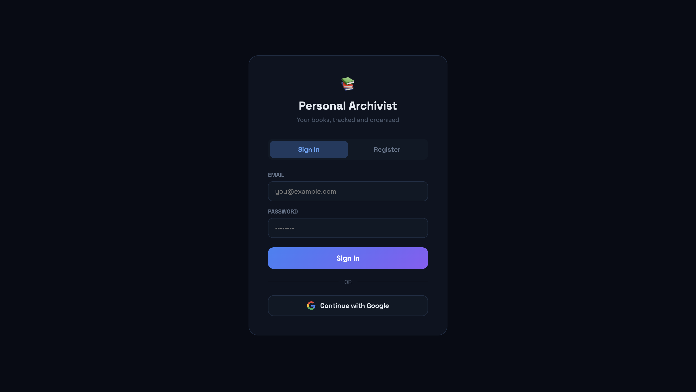
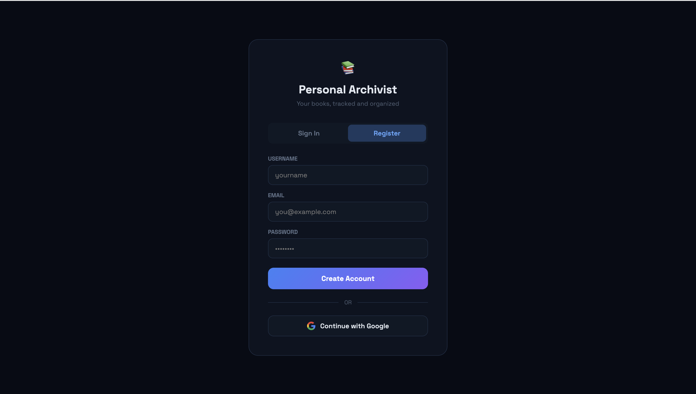
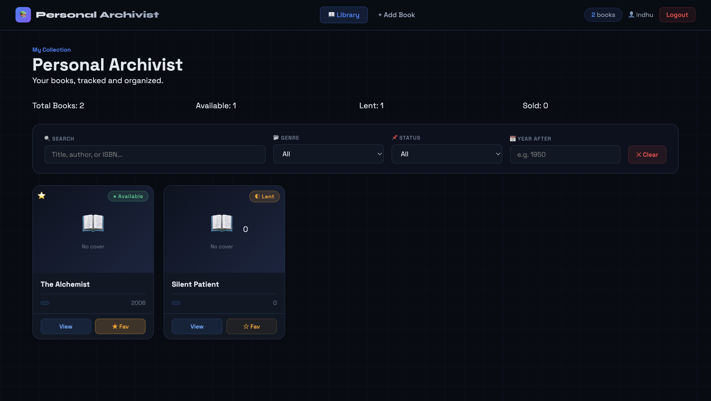

# 📚 Personal Archivist

Personal Archivist is a full-stack web application that helps users organize, track, and manage their personal book collections. Users can register, log in securely, maintain their library, track reading status, mark favorites, rate books, and view collection statistics.

## 🚀 Live Demo

**Frontend:**
https://personal-archivist-1-q20dzfqv9-harishni-5s-projects.vercel.app

**Backend API:**
https://personal-archivist-production.up.railway.app

**API Documentation (Swagger UI):**
https://personal-archivist-production.up.railway.app/docs

**video (drive link):**
https://drive.google.com/file/d/1IK42hCsUAff5_NliiR9QIwlzWCOLPFwZ/view?usp=sharing


---

## ✨ Features

### Authentication

* User Registration
* Secure Login with JWT Authentication
* Google OAuth Login
* Protected Routes
* User Profile Retrieval

### Book Management

* Add Books
* Update Book Information
* Delete Books
* View Personal Library
* Track Reading Status

Supported statuses:

* Available
* Reading
* Read
* Lent
* Sold

### Personalization

* Mark Books as Favorites
* Rate Books
* User-specific Collections

### Analytics Dashboard

* Total Books Owned
* Books Read
* Currently Reading
* Books Lent
* Books Available
* Books Sold
* Favorite Books Count

---
## 🏛️ Architecture

Frontend (React + Vite)
    ↓
REST API (FastAPI)
    ↓
MySQL Database
    ↓
Railway Deployment

Authentication:
JWT + Google OAuth

---

## 🏗️ Tech Stack

### Frontend

* React
* Vite
* JavaScript
* CSS

### Backend

* FastAPI
* Python
* JWT Authentication
* Google OAuth

### Database

* MySQL

### Deployment

* Frontend: Vercel
* Backend: Railway
* Database: Railway MySQL


---

## 🔐 Environment Variables

### Backend (.env)

```env
DB_HOST=
DB_PORT=
DB_NAME=
DB_USER=
DB_PASSWORD=

JWT_SECRET=

GOOGLE_CLIENT_ID=
GOOGLE_CLIENT_SECRET=
GOOGLE_REDIRECT_URI=

FRONTEND_URL=
```

### Frontend (.env)

```env
VITE_API_URL=https://personal-archivist-production.up.railway.app
```

---

## ⚙️ Installation

### Clone Repository

```bash
git clone https://github.com/harishni-5/personal-archivist.git
cd personal-archivist
```

---

### Backend Setup

```bash
cd backend

python -m venv venv

# Windows
venv\Scripts\activate

# Mac/Linux
source venv/bin/activate

pip install -r requirements.txt

uvicorn api:app --reload
```

Backend runs at:

```text
http://localhost:8000
```

Swagger documentation:

```text
http://localhost:8000/docs
```

---

### Frontend Setup

```bash
cd frontend

npm install

npm run dev
```

Frontend runs at:

```text
http://localhost:5173
```

---

## 📡 API Endpoints

### Authentication

| Method | Endpoint                  |
| ------ | ------------------------- |
| POST   | /api/auth/register        |
| POST   | /api/auth/login           |
| GET    | /api/auth/me              |
| GET    | /api/auth/google          |
| GET    | /api/auth/google/callback |

### Books

| Method | Endpoint          |
| ------ | ----------------- |
| GET    | /api/books        |
| POST   | /api/books        |
| PUT    | /api/books/{isbn} |
| DELETE | /api/books/{isbn} |

### Statistics

| Method | Endpoint   |
| ------ | ---------- |
| GET    | /api/stats |

---

## 🔒 Security Features

* Password Hashing using PBKDF2-SHA256
* JWT Token Authentication
* CORS Protection
* Protected API Routes
* Secure Environment Variables
* Google OAuth Integration

---

## 📸 Screenshots

Add screenshots here:

* Login Page
* Registration Page
* Dashboard
* Book Management Screen
* Statistics View

Example:

## Screenshots

### Login Page


### Register Page


### Dashboard


## 🎯 Future Improvements

* Book Cover Uploads
* Search & Filter Functionality
* Reading Progress Tracking
* Book Recommendations
* Export Library to CSV/PDF
* Dark/Light Theme Toggle
* Admin Dashboard

---

## 👩‍💻 Author

**Harishni Vasagam**

Vellore Institute of Technology, Chennai

GitHub: https://github.com/harishni-5

---

## 📄 License

This project is intended for educational and portfolio purposes.
